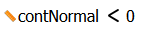
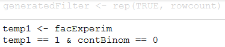
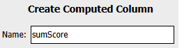
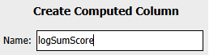
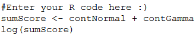
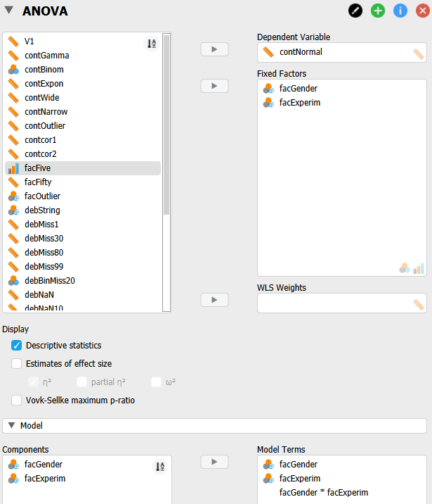
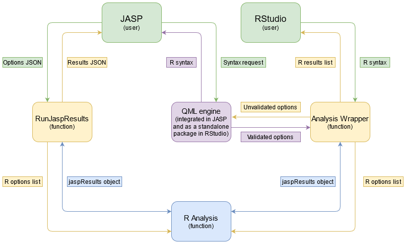
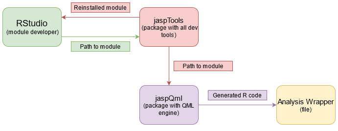

- [Part I. Definition and Goals](#Part-I-Definition-and-Goals)
  - [Definition](#Definition)
  - [Use Case](#Use-Case)
  - [Primary Goals of the Syntax Mode Implementation](#Primary-Goals-of-the-Syntax-Mode-Implementation)
  - [Intended Limitations of Syntax Mode](#Intended-Limitations-of-Syntax-Mode)
- [Part II. Examples of the Intended Syntax](#Part-II-Examples-of-the-Intended-Syntax)
  - [Filters](#Filters)
  - [Computed Columns](#Computed-Columns)
  - [Analyses](#Analyses)
      - [Formulas](#Formulas)
- [Part III. Implementing the Syntax Mode Framework](#Part-III-Implementing-the-Syntax-Mode-Framework)
  - [New Components](#New-Components)
    - [jaspQml](#jaspQml)
      - [Additional Thoughts](#Additional-Thoughts)
    - [Analysis Wrapper](#Analysis-Wrapper)
      - [Additional Thoughts](#Additional-Thoughts-1)
    - [Formula](#Formula)
      - [Additional Thoughts](#Additional-Thoughts-2)
  - [User Interaction within JASP](#User-Interaction-within-JASP)
    - [Displaying Syntax in JASP](#Displaying-Syntax-in-JASP)
    - [Running Syntax in the JASP R Editor](#Running-Syntax-in-the-JASP-R-Editor)
      - [Additional Thoughts](#Additional-Thoughts-3)
  - [User Interaction within RStudio](#User-Interaction-within-RStudio)
    - [Package Eco-system](#Package-Eco-system)
    - [Running Environment](#Running-Environment)

# Part I. Definition and Goals

## Definition
Syntax Mode refers to the ability for users to see what code generates the output they see. This includes filters, computed columns and analyses.


## Use Case
1. Syntax Mode will provide a smoother transition from SPSS that makes heavy use of syntax.
2. With Syntax Mode it becomes easier to develop new R analyses as they can be run from RStudio with little effort.
3. Syntax can easily be shared between colleagues and attached to appendices.
4. JASP can be used as a tool to expose students to R.


## Primary Goals of the Syntax Mode Implementation
1. The syntax will cover filters, computed columns and analyses.
2. The syntax will be valid R and can be run outside of JASP in RStudio and in the R editor of JASP.
3. The syntax will be consistent with the syntax you would provide to regular R packages (e.g., `stats::lm()`).
4. The user will need to perform minimal additional steps after copy-pasting to generate output similar to that seen in JASP (i.e., only read data).
5. The output of the syntax in RStudio will generate a structure that R users are familiar with.
6. The syntax is set up in a way that will, **in the future**, allow users to execute syntax inside of JASP and have JASP perform the specified filters/computed columns/analyses and show them in the interface (so not in the R editor). This is more a nice to have though.
7. The user can easily access documentation of the syntax (through `?`) without needing to read the helpfiles in JASP.


## Intended Limitations of Syntax Mode
1. The syntax does not need to be executable in JASP at present (other than in the R editor), but we'll likely want that at a later stage (see also bullet 6 of the Primary Goals).
2. The syntax can be separate statements that are not linked together. What this means is that it is acceptable not to include package installing, data reading and temporary variables (although we could add this as an additional feature). By doing this we will ensure it will be easier to later execute our generated syntax inside of JASP (once we reach that point). An example of the distinction between linked and separate statements:
   
Separate statements:
```
filter(...)
mutate(...)
anova(...)
```
Linked statements:
```
if (!require(jasp)) install.packages("jasp")
library(jasp)
read.csv(...) %>% filter(...)
              %>% mutate(...)
              %>% anova(...)
```


# Part II. Examples of the Intended Syntax

## Filters
This will be based on `dplyr::filter()`, with only one proposed adjustment to dplyr's logic: allow no data to be passed in, in which case we search for a dataset in the `parent.frame`. This ensures we don't have to enter `dplyr::filter(data = dataset, ...)` everywhere and make it easier to execute inside the R editor of JASP (which has a fixed name for the dataset). The following filters are already natively supported by `dplyr::filter()` and return filtered `data.frame`'s:

From JASP's "drag 'n drop interface" filter:


```
filter(contNormal < 0)
```
From JASP's "R interface" filter:


```
filter({
    temp1 <- facExperim
    temp1 == 1 & contBinom == 0
})
```


## Computed Columns
This will be based on `dplyr::mutate()`, with the same proposed change of removing `data`, and possibly a rename of the function to `compute`. The following ways of column adding are already natively supported by `dplyr::mutate()` and return `data.frame`'s with the additional columns:

From JASP's "drag 'n drop interface" compute column:




```
compute(sumScore = contNormal + contGamma)
```

From JASP's "R interface" compute column:




```
compute(logSumScore = {
  sumScore <- contNormal + contGamma
  log(sumScore)
})
```


## Analyses
These functions are intended to be alike to statistical functions such as `stats::lm()`, especially in regards to the use of [formulas](http://conjugateprior.org/2013/01/formulae-in-r-anova/). JASP's analysis functions should only deviate from other R functions when it comes to output. Whereas JASP will creates lots of output from a single function call, regular R functions generally only do "one thing". However, our approach isn't necessarily worse than the norm, as it requires the users to only know about one single function. The benefit to us is that Syntax Mode does not require changes to existing analyses. To create a clean interface for users to interact with the analyses, we will need wrappers around them. The next example shows how the options in JASP would map to a wrapper call for our ANOVA analysis:



```
anova(formula = contNormal ~ facGender + facExperim + facGender * facExperim,
      descriptives = TRUE)
```

#### Formulas
Formulas complicate the implementation, but simplify the syntax. Furthermore, they are the standard way in which models are specified in R. The next example shows the benefit of formulas by repeating the previous ANOVA call, but without using a formula:
```
anova(dep = "contNormal",
      fixed = c("facGender", "facExperim"),
      modelTerms = list(list(components = "facGender"), list(components = "facExperim"), list(components = c("facGender", "facExperim"))),
      descriptives = TRUE)
```


# Part III. Implementing the Syntax Mode Framework
The Syntax Mode framework will require new R packages to be created, demand multiple UI changes as well as changes to the backend of JASP. This section does not go into minute detail about the implementation of this framework. Rather, it serves to point out all the major areas that need to be worked on and the caveats that should be considered during implementation. The following flowcharts intend to highlight these areas by showing how both users and developers will interact with them; further detail is provided further down.



Flowchart 1. This flowchart shows the user interaction with the Syntax Mode in JASP and RStudio when they are running analyses. Note that the flow of information on the left hand side (from JASP to the R Analysis) does not change from how it is currently implemented. Nor will any analysis expect a different input from what it already receives.



Flowchart 2. This flowchart shows the developer interaction in RStudio when they are creating a new module and wish for it to be installed so they can test it. The Analysis Wrapper will be a dedicated file placed in the `/module/R/` folder.

## New Components

### jaspQml
We require the ability in both JASP and RStudio to validate the input users give. For example, a confidence interval must be between 0 and 100. Our analyses are programmed in such a way that we expect such assumptions to be true. In JASP this validation occurs in the QML layer and it makes sense to use this same code in RStudio as well. As such, we'll need to be able to separate the QML engine and components from JASP and be able to provide them in RStudio. We can then ensure that the syntax provided to our analyses passes the same validation checks. One way to do this is to create a jaspQml package and add this as a submodule in jasp-desktop. This package should implement the following:
- Input validation in both JASP and RStudio, such that input that is forbidden in JASP is also forbidden in RStudio.
- Encoding of dataset columns and the input options (i.e., the conversion to `JaspColumn_.*._Encoded`) to ensure that any variable name that is valid in JASP is also valid in RStudio. Barring characters that R would deem illegal, of course.
- Ability to generate syntax from selected options in JASP. Each QML component should have a `toSyntax` method that returns the representation in terms of R syntax. This includes being able to generate the formula ([as discussed below](#the-formula)).
- Ability to generate the analysis wrapper, including roxygen based documentation so calling `?jaspAnova::anova` will provide users with a familiar help interface ([see below](#analysis-wrapper)).

#### Additional Thoughts
- Formula's will be provided in the input and these will need to be parsed. Instead of doing this in jaspQml, this could also be done on the R side in the wrapper. The advantage of doing this in the wrapper, is that the QML engine package could become an optional dependency (i.e., people can choose whether their package should perform such input validation at the cost of having a bigger footprint), as the package will then only encode and validate options.
- The package should pass R CMD CHECK and follow the CRAN guidelines (as detailed at https://cran.r-project.org/web/packages/policies.html) so we have the ability of adding it to CRAN -- note that this is especially important if we decide the package must be a required module dependency.


### Analysis Wrapper
The Wrapper is what users interact with when running the analysis syntax in RStudio or in the JASP R editor. Having it "hardcoded" in the module has the advantage that the analysis becomes searchable, has auto-complete for its arguments and has a dedicated place for the documentation. The Wrapper could be viewed as having a similar role to `runJaspResults()` and adds functionality required to run an analysis interactively in RStudio. This includes translating the syntax back into an R options list, decomposing a formula (unless this is performed in jaspQml [as discussed above](#Additional-Thoughts)) and making sure validation occurs by calling jaspQml. Furthermore, the Wrapper should deal with the setup and breakdown of the jaspResults object, error handling and printing a summary.

<details>

<summary>Example of a naive Wrapper that shows how the formulas can be used, but lacks validation</summary>

Syntax to call the wrapper (note that your working directory should be set to your `jaspAnova` clone):
```
if (require(jaspTools))
  bancova(Sepal.Length ~ Species + Sepal.Width, data = iris)
```

Very basic Wrapper code:
```
bancova <- function(formula           = NULL,
                    data              = NULL,
                    dep               = "",
                    fixed             = list(),
                    random            = list(),
                    covariates        = list(),
                    model             = list(),
                    nullModel         = NULL,
                    priorFixed        = 0.5,
                    priorRandom       = 1,
                    priorCovariates   = 0.354,
                    effects           = FALSE,
                    effectsType       = "allModels",
                    postEst           = FALSE,
                    ci                = 0.95,
                    criTable          = FALSE,
                    bfOrder           = "bestModelTop",
                    bfType            = "BF10",
                    groupPost         = "grouped",
                    singleModel       = list(),
                    singleEst         = FALSE,
                    singleCriTable    = FALSE,
                    singlePostPlot    = FALSE,
                    singleQqPlot      = FALSE,
                    singleRsqPlot     = FALSE,
                    singleGroupPost   = "grouped",
                    postHocVars       = list(),
                    postHocNull       = TRUE,
                    descr             = FALSE,
                    descrVarOnYAxis   = "",
                    descrVarAsLines   = "",
                    descrVarAsPlots   = "",
                    wantPlotCi        = FALSE,
                    plotCi            = 0.95,
                    postPlot          = FALSE,
                    qqPlot            = FALSE,
                    rsqPlot           = FALSE,
                    fixedNumAcc       = 1,
                    fixedMCMCSamples  = 1,
                    sampleModeNumAcc  = "auto",
                    sampleModeMCMC    = "auto",
                    setSeed           = FALSE,
                    seed              = 1) {
  
  defaultArgCalls <- formals(as.character(match.call()[[1]]))
  defaultArgs <- lapply(defaultArgCalls, eval)
  
  options <- as.list(match.call())
  options <- modifyList(defaultArgs, options)
  options[["data"]] <- NULL
  if (!is.null(formula)) {
    
    if (!inherits(formula, "formula"))
      formula <- as.formula(formula)
    
    if (dep != "")
      formula <- addToFormula(formula, terms = dep, type = "lhs")
    if (length(fixed) > 0)
      formula <- addToFormula(formula, terms = fixed, type = "rhs")
    if (length(random) > 0)
      formula <- addToFormula(formula, terms = random, type = "rhs")
    if (length(covariates) > 0)
      formula <- addToFormula(formula, terms = covariates, type = "rhs")
    
    options$dep <- getFromFormula(formula, data, type = "lhs", mode = "numeric", exclude = random, nullValue = defaultArgs[["dep"]])
    options$fixed <- getFromFormula(formula, data, type = "rhs", mode = "factor", exclude = random, nullValue = defaultArgs[["fixed"]])
    options$covariates <- getFromFormula(formula, data, type = "rhs", mode = "numeric", exclude = random, nullValue = defaultArgs[["covariates"]])
    
    if (length(model) == 0)
      options$model <- createModelFromFormula(formula, type = "rhs", nuisance = list(name = "isNuisance", terms = nullModel))
    
    if (length(singleModel) == 0)
      options$singleModel <- createModelFromFormula(formula, type = "rhs")
  }
  
  options[["formula"]]   <- NULL
  options[["nullModel"]] <- NULL
  
  # this will go as name changes are permanent
  options <- convertOptionNames(options)
  # this will go when the jaspBase package defines all C++ objects
  jaspTools::runAnalysis("AncovaBayesian", dataset=data, options=options)
  jaspResults$print()
  
  # it might look a little like the following:
  #jaspResults <- initJaspResults()
  #jaspAnova:::.ancovaBayes(jaspResults=jaspResults, dataset=data, options=options)
  #summary(jaspResults)
  #return(invisible(jaspResults$asResults()))
}

createModelFromFormula <- function(formula, type, nuisance = list(), excludeInteractions = FALSE) {
  if (! type %in% c("lhs", "rhs"))
    stop("Can only get rhs or lhs terms from a formula")
  
  components <- splitFormula(formula, excludeInteractions)[[type]]
  
  model <- vector("list", length(components))
  for (i in seq_along(components)) {
    model[[i]] <- createModelComponentItem(components[[i]], nuisance)
  }
  
  return(model)
}

createModelComponentItem <- function(component, nuisance) { # nuisance needs to be expanded to other column types..
  result <- list()
  result[["components"]] <- expandInteractionTerm(component)
  if (length(nuisance) > 0) {
    
    nuisanceTerms <- NULL
    if (inherits(nuisance[["terms"]], "formula"))
      nuisanceTerms <- splitFormula(nuisance[["terms"]])[["rhs"]]
    
    result[[nuisance[["name"]]]] <- isTRUE(component %in% nuisanceTerms)
  }
  
  return(result)
}

expandInteractionTerm <- function(term) {
  return(unlist(strsplit(term, ":", fixed = TRUE)))
}

getFromFormula <- function(formula, data, type, mode = NULL, exclude = c(), nullValue = NULL) {
  if (! type %in% c("lhs", "rhs"))
    stop("Can only get rhs or lhs terms from a formula")
  
  if (!is.data.frame(data))
    stop("Expecting data to be a data.frame")
  
  components <- splitFormula(formula, excludeInteractions = TRUE)[[type]]
  components <- getComponentsOfCorrectMode(components, data, mode)
  components <- setdiff(components, exclude)
  
  if (length(components) == 0)
    components <- nullValue
  
  return(components)
}

getComponentsOfCorrectMode <- function(components, data, mode) {
  if (!all(components %in% names(data)))
    stop("Not all formula components appear in the dataset")
  
  result <- NULL
  for (component in components) {
    if (mode == "factor" && is.factor(data[[component]]))
      result <- c(result, component)
    else if (mode == "numeric" && is.numeric(data[[component]]))
      result <- c(result, component)
  }
  
  return(result)
}

splitFormula <- function(formula, excludeInteractions = FALSE) {
  if (!inherits(formula, "formula"))
    stop("Expecting formula to be of class `formula`")
  
  terms <- as.character(formula)
  if (length(terms) < 3) { # there is no lhs
    lhs <- NULL
    rhs <- terms[2]
  } else {
    lhs <- terms[2]
    rhs <- terms[3]
  }
  
  return(list(lhs = getComponentsFromTerm(lhs, excludeInteractions),
              rhs = getComponentsFromTerm(rhs, excludeInteractions)))
}

addToFormula <- function(formula, terms, type) {
  ### what about interactions?
  if (! type %in% c("lhs", "rhs"))
    stop("Can only add rhs or lhs terms to a formula")
  
  if (!is.character(terms))
    stop("Expecting character vector of terms")
  
  components <- splitFormula(formula)
  
  if (type == "lhs")
    components[["lhs"]] <- union(components[["lhs"]], terms)
  else
    components[["rhs"]] <- union(components[["rhs"]], terms)
  
  return(makeFormula(lhs = components[["lhs"]], rhs = components[["rhs"]]))
}

getComponentsFromTerm <- function(term, excludeInteractions) {
  if (!is.character(term) || nchar(term) == 0)
    return(NULL)
  
  components <- trimws(unlist(strsplit(term, "+", fixed = TRUE)))
  
  if (excludeInteractions) {
    purgedComponents <- NULL
    for (component in components)
      if (!grepl(":", component, fixed = TRUE))
        purgedComponents <- c(purgedComponents, component)
      components <- purgedComponents
  }
  
  return(components)
}

makeFormula <- function(lhs, rhs, env = parent.frame(2)) {
  lhs <- paste(lhs, collapse = "+")
  rhs <- paste(rhs, collapse = "+")
  
  return(formula(paste(lhs, "~", rhs), env = env))
}

convertOptionNames <- function(options) {
  mapping <- list(dep               = "dependent", # formula, nullModel
                  fixed             = "fixedFactors",
                  random            = "randomFactors",
                  covariates        = "covariates",
                  model             = "modelTerms",
                  priorFixed        = "priorFixedEffects",
                  priorRandom       = "priorRandomEffects",
                  priorCovariates   = "priorCovariates",
                  effects           = "effects",
                  effectsType       = "effectsType",
                  postEst           = "posteriorEstimates",
                  ci                = "credibleInterval",
                  criTable          = "criTable",
                  bfOrder           = "bayesFactorOrder",
                  bfType            = "bayesFactorType",
                  groupPost         = "groupPosterior",
                  singleModel       = "singleModelTerms",
                  singleEst         = "singleModelEstimates",
                  singleCriTable    = "singleModelCriTable",
                  singlePostPlot    = "singleModelPosteriorPlot",
                  singleQqPlot      = "singleModelqqPlot",
                  singleRsqPlot     = "singleModelrsqPlot",
                  singleGroupPost   = "singleModelGroupPosterior",
                  postHocVars       = "postHocTestsVariables",
                  postHocNull       = "postHocTestsNullControl",
                  descr             = "descriptives",
                  descrVarOnYAxis   = "plotHorizontalAxis",
                  descrVarAsLines   = "plotSeparateLines",
                  descrVarAsPlots   = "plotSeparatePlots",
                  wantPlotCi        = "plotCredibleInterval",
                  plotCi            = "plotCredibleIntervalInterval",
                  postPlot          = "posteriorPlot",
                  qqPlot            = "qqPlot",
                  rsqPlot           = "rsqPlot",
                  fixedNumAcc       = "fixedNumAcc",
                  fixedMCMCSamples  = "fixedMCMCSamples",
                  sampleModeNumAcc  = "sampleModeNumAcc",
                  sampleModeMCMC    = "sampleModeMCMC",
                  setSeed           = "setSeed",
                  seed              = "seed")
  
  oldNames <- names(options)
  newNames <- oldNames
  for (i in seq_along(oldNames))
    if (oldNames[i] %in% names(mapping))
      newNames[i] <- mapping[[oldNames[i]]]
  
  names(options) <- newNames
  
  return(options)
}
```

</details>

#### Additional Thoughts
- The Wrapper should be able to call the column encoding functionality itself, or this should be done in jaspQml.
- How should the name of the Wrapper differ from the analysis function name? Perhaps: anova and .anova -- Wrapper and analysis, respectively.
- Some analyses have a whole host of options appearing and disappearing (e.g., network analysis) that must all be present in the Wrapper; it might become a little difficult for a user to create a function call from scratch (although creating these calls manually from scratch is obviously not the main intention of Syntax Mode).
- All options should be renamed to something shorter that still makes sense. Consequently, everything will need to be added to the upgrader.
- If we add the help from our helpfiles (accessible through e.g., `?jasp::banova`), then it won't always be clear to the user what the actual R input should be. For example, from ttestpairedsamples.md we obtain the following info about `variables`: `In this box the variables are selected for which the difference is computed. Multiple differences can be analysed at the same time by specifying different rows with two variables for which the difference is computed. In other words, each row represents other difference scores."` which does not relay that it should be `list(c("var1", "var2"))`. However, we know the structure of our QML options, so this could be generated.


### Formula
The formula is basically a summary of multiple `AssignedVariableList`s together with the model terms component. Formulas consist of left hand side (lhs) and right hand side (rhs) operators. The lhs are dependent variables that are `+` separated. The rhs are independent variables that are also `+` separated; rhs terms may also contain interactions of multiple independent variables, specified by a `*`.

One way to specify formulas could be to introduce the following three properties to the QML:
- `positionFormula`: `"lhs"` or `"rhs"`. Can be used to specify on what side of the `~` the terms need to go in the formula.
- `mustSpecify`: `true` or `false`. It needs to remain possible to uniquely identify which independent variable in the formula comes from which box (e.g., fixed factor, random factor, covariate). The distinction between fixed/random factors on the one hand and covariates on the other can be made based on type (factor vs numeric), but the distinction between fixed and random factors cannot be made -- they are both factors. In this case the random factor needs the property set to `true` to signify that it must always be specified in addition to the formula (e.g., `formula = ~ contBinom + facGender, random = contBinom)`).
- `modelSpecification`: `true` or `false`. Needs to be set to `true` if an `AssignedVariablesList` exists that dictates which rhs terms are included in the model (this is the case in the ANOVA's and Regression's); the terms included in this `AssignedVariablesList` are a superset of the individual fields with the  `"rhs"` specification and so can be used directly.

<details>

<summary>Example of specifying a formula in QML</summary>

```
VariablesForm
{
    AvailableVariablesList { name: "allVariablesList" }
    AssignedVariablesList  { name: "dependent";		title: qsTr("Dependent Variable");	positionFormula: "lhs"; suggestedColumns: ["scale"]; singleVariable: true;          }
    AssignedVariablesList  { name: "fixedFactors";	title: qsTr("Fixed Factors");		positionFormula: "rhs"; suggestedColumns: ["ordinal", "nominal"];                   }
    AssignedVariablesList  { name: "randomFactors";	title: qsTr("Random Factors");		positionFormula: "rhs"; suggestedColumns: ["ordinal", "nominal"]; mustSpecify: true }
    AssignedVariablesList  { name: "wlsWeights";	title: qsTr("WLS Weights");	                                suggestedColumns: ["scale"]; singleVariable:                }
}
```

This analysis has model terms so we specify this is the case and consequently the rhs of the formula will be populated by this field:
```
VariablesForm
{
    AvailableVariablesList { name: "components"; title: qsTr("Components"); source: ["fixedFactors", "randomFactors"]                 }
    AssignedVariablesList  { name: "modelTerms"; title: qsTr("Model Terms"); listViewType: JASP.Interaction; modelSpecification: true }
}

```
Note that despite the existence of `modelSpecification: true`, it is still necessary to specify the `rhs` terms separately in the QML, because otherwise it won't be possible to know which terms can be excluded from the R syntax in favour of the formula (for example, `wlsWeights` would still need to be included in addition to the formula).

</details>

#### Additional Thoughts
- It is possible to include additional properties in each row of the model terms (e.g., "include in null"). So far, this has always been a single checkbox and can be solved by having two formulas, one that specifies the full model and one that specifies which are null terms (e.g., `formula = ~ contBinom + facGender, nullFormula = ~ contBinom)`). However, this will not work as easily with anything other than a checkbox and in those cases it might be necessary to disallow formulas.
- Can analyses have multiple formulas? Inclined to say no, to make this easier and consistent with other R packages.
- Where in the options list that we provide to analyses do we add the new parameters `formula` and `nullModel`? They could go inside the the model terms list or we could keep them as additional arguments.
- Formulas do not quote their variables, it would be nice if all variables could be entered unquoted even outside of formula's. Example code for this:

<details>

<summary>Code for unquoted variables</summary>

```
# possible types: single, vector, list of vectors (pairs), interaction, with row components
main <- function(single, vector, pairs, interaction, rowComponents, data) {
  single        <- toStringTerms(substitute(single),        data)
  vector        <- toStringTerms(substitute(vector),        data)
  pairs         <- toStringTerms(substitute(pairs),         data, type = "paired")
  interaction   <- toStringTerms(substitute(interaction),   data)
  rowComponents <- toStringTerms(substitute(rowComponents), data, type = "rowComponents")
  
  print(single); print(vector); print(pairs); print(interaction); print(rowComponents)
}

toStringTerms <- function(unevalExpr, data, type = "regular") {
  if (type == "rowComponents" || type == "paired") {
    lst <- as.list(unevalExpr)

    if (lst[[1]] != "list")
      stop("Argument requires a list of elements")
    
    lst[[1]] <- NULL
    
    if (type == "rowComponents")
      return(stringifyRowComponents(lst))
    
    if (type == "paired")
      return(stringifyPairs(lst))
  } else {
    return(stringifyTerms(unevalExpr, data))
  }
}

stringifyRowComponents <- function(lst) {
  if (!"terms" %in% names(lst))
    stop("Argument needs to be a named list with the entry `terms`")
  
  lst[["terms"]] <- stringifyTerms(lst[["terms"]], data)
  
  return(lst)
}

stringifyPairs <- function(lst) {
  lapply(lst, stringifyTerms, data = data)
}

stringifyTerms <- function(unevalExpr, data) {
  terms <- asCharacterVector(unevalExpr)
  
  for (term in terms) {
    interactions <- hasInteractions(terms)
    if (hasInteractions(term)) {
      
      components <- splitInteractions(terms)
      if (!all(termIsValidColumn(components, data)))
        stop("The interaction term (", term, ") contains unknown data columns")
      
    } else if (!termIsValidColumn(term, data)) {
        stop("The term (", term, ") could not be found in the data")
    }
  }
  
  return(terms)
}

asCharacterVector <- function(unevalExpr) {
  result <- unevalExpr

  charRepresent <- as.character(unevalExpr)
  if (inherits(unevalExpr, "name")) # e.g., contNormal
    result <- charRepresent
  else if (inherits(unevalExpr, "call") && charRepresent[[1]] == "c" && length(charRepresent) > 1) # e.g., c(contNormal, contGamma)
    result <- charRepresent[2:length(charRepresent)]
  else if (inherits(unevalExpr, "call")) # e.g., contNormal:contGamma
    result <- deparse(unevalExpr)

  return(result)
}

termIsValidColumn <- function(term, data) {
  term %in% names(data)
}

hasInteractions <- function(term) {
  grepl(":", term)
}

splitInteractions <- function(term) {
  unlist(stringr::str_split(term, ":"))
}


###### -------- example
data <- data.frame(col1 = 1:10, col2 = 1:10, col3 = 1:10)
main(single        = col1, 
     vector        = c("col1", col2), 
     pairs         = list(c(col1, col2), c(col1, col3)), 
     interaction   = c(col1, col2, col1:col2),
     rowComponents = list(terms = c(col1, "col1:col2", col2),
                          null  = c(T, T, F)),
     data          = data)
```

</details>


## User Interaction within JASP

### Displaying Syntax in JASP
There needs to be an area in JASP where the user can find the syntax that was generated by their option selection. Considering syntax is a description of the input of an analysis a natural place for this would be to be in the QML input panel. We can add an additional button on top of each analysis panel that lets users toggle between clickable options and the syntax. The syntax will be fetched by querying the QML layer.


### Running Syntax in the JASP R Editor
At the bare minimum the syntax should give results in our R editor, RStudio is our ultimate goal but this is first thing to aim for. It's easier than RStudio, because the data is already loaded, the C++ objects are present and all packages are loaded. The focus here should be on making sure that the results make sense in an R console. This means:
- Creating a summary method with a very good looking ASCII print; either we should work on our current implementation or use something like the [stargazer](https://cran.r-project.org/web/packages/stargazer/vignettes/stargazer.pdf) package:
```
> stargazer::stargazer(head(iris), type = "text")

===========================================================
Statistic    N Mean  St. Dev.  Min  Pctl(25) Pctl(75)  Max 
-----------------------------------------------------------
Sepal.Length 6 4.950  0.288   4.600  4.750    5.075   5.400
Sepal.Width  6 3.383  0.343   3.000  3.125    3.575   3.900
Petal.Length 6 1.450  0.138   1.300  1.400    1.475   1.700
Petal.Width  6 0.233  0.082   0.200  0.200    0.200   0.400
-----------------------------------------------------------
```

- Making sure the output structure is more 'sane'; the excessive nesting should be reduced to top level elements. Index names must be short and to the point, instead of the long concatenations.
- Tables need to be a common format like a regular `data.frame` or the like that allows users to use the table data for further analysis.
- Plots should go to the plot device and the plot object returned in the results list (the R editor should be able to handle plots without crashing).

#### Additional Thoughts
- How should a table with collapsed columns be represented in R? It can't be a normal `data.frame` because the columns mix types.
- We could automatically give tips in the R editor if we see a filter or compute column command that is not stored in the data by the user.
- `info(jasp::banova(...args...))` could be used to return additional info in an enriched ASCII representation of the analysis. Each output element will have info added next to it; these info elements can be extracted from the `$addInfo`'s used in the analysis.


## User Interaction within RStudio

### Package Eco-system
To make it easy to perform an analysis in R it needs to be simple to install our R packages and run them. They should not require anything from JASP.
A number of packages need to be created with distinct sets of functionality. Doing so, will ensure people can check the namespace and only find a coherent set of functions. Furthermore, this will ensure we can easily update separate components, without users having to reinstall everything when something changes unrelated to what they do (i.e., develop, or run analyses).
- `jasp`: A package that bundles the common R analyses in one namespace. Installs all the required R analysis packages that are created by the JASP team. Exports only the analysis functions and the functions for the filter and column computation. The benefit of this approach is that users only need to know about a single package, only need to install packages once and it becomes clear from looking at the `jasp` namespace which analyses are available. Additional modules can be installed as separate R packages.
- `jaspBase`: A package that contains all the building blocks for creating a JASP R analysis. This should be a combination of `jaspResults` with the current `jaspBase`. It's important `jaspResults` is extracted from JASP, because it needs to be installable in R without having the jasp-desktop repo.
- `jaspQml`: A package that provides encoding of input, option validation and the ability to generate wrappers from QML source files.
- `jaspGraphs`: A package that handles all our plotting needs.
- `jaspTools`: A package that aids an R analysis developer with the creation of their JASP R analysis. It exports functions related to the creation of an JASP module skeleton, the handling of translations, creation of a Wrapper by calling jaspQml, unit testing, etc.


### Running Environment
At present jaspTools is required to run an analysis, this is mainly because JASP inserts certain objects into the global R environment, which naturally do not exist when run outside of JASP. To ensure analyses can be run in RStudio:
- The `jaspBase` package needs to provide drop-in replacements for the C++ functions defined in `jasprcpp.cpp` (e.g., `encodeColNamesStrict`).
- Either the `jaspQml` or `jaspBase` packages needs to make column encoding available to ensure that when an analysis works in JASP it will also work in RStudio.
- The `jaspBase` package needs to make the `jaspResults` object assignable to a variable, in this way users can run multiple analyses.
- Each analysis must be able to correctly deal with receiving data directly through the `dataset` argument.